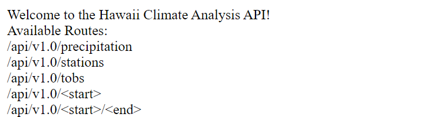

# Trip Research Using SQLAlchemy

<ins>Project Overview</ins>
-----

For this project, I completed some research for planning a trip to Hawaii. I conducted some climate analysis about the area using two CSV files and a SQL query file to find information about the temperature and precipitation of different stations around Hawaii.

<ins>Process and Technologies</ins>
-----

This application is designed to use the SQLAlchemy `create_engine()` function to connect to my SQLite database, use the `automap_base()` function to reflect my tables into classes and save the references to the classes `station` and `measurement`. By linking Python to a SQLAlchemy session, I was able to perform a precipitation analysis, a station analysis and design a climate app. The two analyses were fairly straightforward using the `session.query` format to gather the information about the most active station from the past year. This information was plotted as shown below:
    

    

The latter part of this assignment was to create a climate app using a Flask API based on the queries I completed in the previous sections of code. To do this, I needed to convert the query results from my precipitation analysis into a dictionary using `date` as the key and `pcrp` as the value and return a JSON list of stations from the dataset. Ultimately, I created several routes for the API to take including: precipitation, stations, tobs (temperature observation), start and end.

<ins>Challenges</ins>
-----

The biggest challenge that I ran into with this assignment was being able to set up the database correctly for the flask app. At first, I had created a separate database and connected it to the measurement and station tables. This however, did not allow the app to run on my local host, so after consulting with the learning assistant Evan, he helped me to understand how to reflect an existing database into a new model and run `flask --app app run` in my console in order to see the completed flask.
